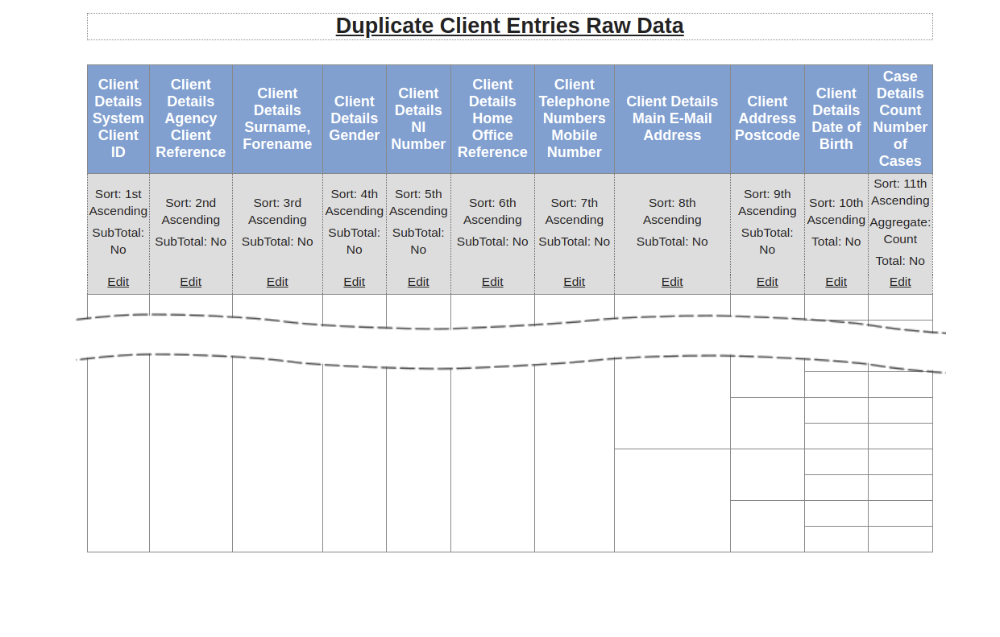

<!-- Required extensions: pymdownx.betterem, pymdownx.tilde, pymdownx.emoji, pymdownx.tasklist, pymdownx.superfences -->
# adviceprodups

Duplicate detection for AdvicePro (a UK web-based case management system)

# Overview

This program takes the output from an AdvicePro report and produces a list of validation errors suspected duplicate clients as a CSV file, which may be imported into a spreadsheet. The AdvicePro report **must** be in exactly the format specified below. If it is not, the program will report an error.

## Validation Checks

The following validation checks are performed.

* System Client ID must be a positive integer number
* Agency Client Reference must be present and a positive integer
* Client name must not be empty
* Gender must be "Male", "Female", or "[Not Specified]"
* NI Number must be in the correct format, or empty
* Mobile Number must be in a valid format, or empty (see below)
* Main E-Mail Address must be in a valid format, or empty
* Postcode must be in a valid format, or empty
* Date of Birth must be a valid date in the last 150 years, or empty
* Number of Cases must be a non-negative integer

The mobile number is validated by removing and non-numeric characters. It must then start with 447, 07, or 7 and contain the correct  number of digits.

## Duplicate Detection

Duplicate detection is partly based on hard tests and partly on fuzzy tests. The comparison between two clients is broadly as follows:

1. If both genders are specified and are different, the two clients are considered different.
1. If any of NI Number, Home Office Reference and Date of Birth are present in both client records and are different, the two clients are considered different.
1. If any of the Agency Client Reference, NI Number, or Home Office Reference are present and the same, the clients are flagged as definite duplicates.
1. The same Mobile Number, Main E-Mail Address, Postcode, or Date of Birth increases the probability of the client records being duplicates. (Dates of birth of the first of January are ignored for this comparison since this is used to flag that only the birth year is known.)
1. If these fields when weighted cross a threshold, the two clients are reported as possible duplicates.
1. Otherwise, if a fuzzy name match multiplied by the weighted matching score exceeds a threshold, the two clients are reported as possible duplicates.

# Running the Program

From a command prompt, enter a command in the following form:

> adviceprodups -o *output file name* *input file name*

Where:

* **output file name** is the location for the output file - the validation and duplicates report
* **input file name** is the location of the CSV file produced by the AdvicePro report generator.

The input file name is required. if no output file name is given (by omitting the -o option). the output will be sent to the standard output stream (*stdout*).

# AdvicePro Report Format

An AdvicePro report containing the following fields in specified order is required:

Because AdvicePro does not currently (April 2021) support export and import of reports, this report will need to be recreated for every installation.

The fields are:

1. System Client ID
1. Agency Client Reference
1. Surname, Forename
1. Gender
1. NI Number
1. Home Office Reference
1. Mobile Number
1. Main E-Mail Address
1. Postcode
1. Date of Birth
1. Number of Cases

Report filters should generally be left empty, but may be used to select a subset of clients for duplicate detection.

The output format must be set to "CSV" when the report is run. (Ignore any warning about the lack of filters.) 

# Installation
## Windows

1. Install Python from https://www.python.org/downloads/windows/ (The version used for testing was V3.8.9, Windows 64-bit.)
1. Run the Windows installation package.
